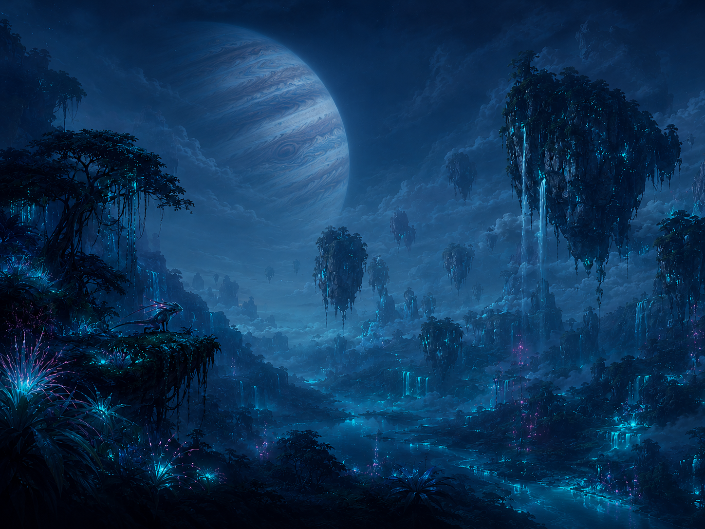
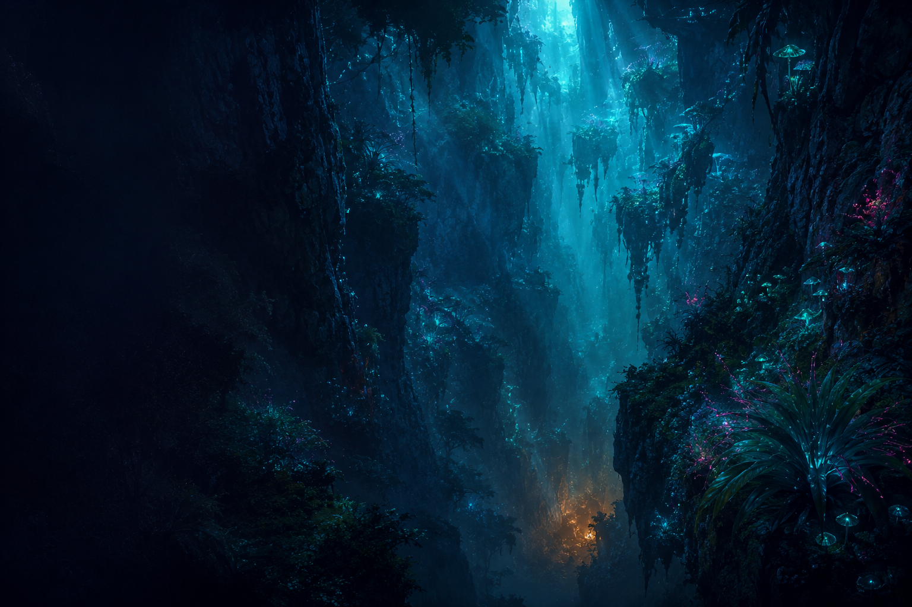
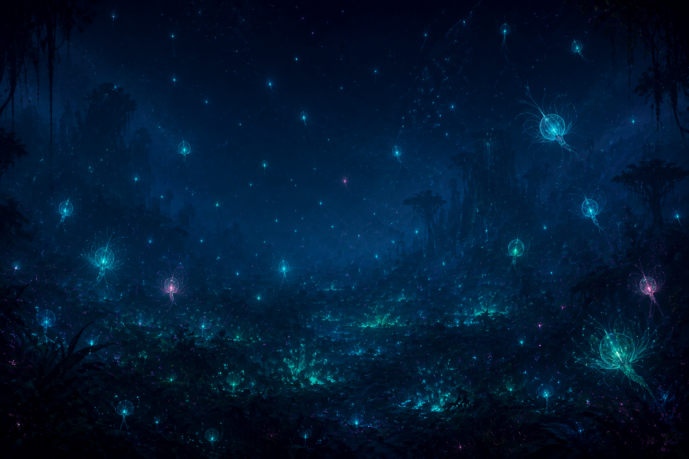

<p align="center">
  
</p>

<h1 align="center">
  🌿 The Pandora Code
</h1>

<p align="center">
  <em>Where wonder becomes understanding,<br/>and an alien moon teaches us the science of our own world.</em>
</p>

<p align="center">
  <a href="#about"><strong>About</strong></a> ·
  <a href="#the-journey"><strong>The Journey</strong></a> ·
  <a href="#what-youll-find-inside"><strong>Inside</strong></a> ·
  <a href="#getting-started"><strong>Get Started</strong></a> ·
  <a href="#credits"><strong>Credits</strong></a> ·
  <a href="#license"><strong>License</strong></a>
</p>

<p align="center">
  
  
  
  
</p>

---

## About

> *Stand on a high ridge on Pandora a little before midday and watch the sky do something the sky on Earth has never once done in four and a half billion years...*

**The Pandora Code** is not a wiki. It is not a fan page. It is a love letter — written in science, illustrated in starlight, addressed to anyone who ever looked up at a fictional sky and wondered: *could this be real?*

Every chapter begins with something strange about the world of Pandora — floating mountains defying gravity, a forest that breathes through fans instead of lungs, a neural network woven from the roots of an entire planet — and ends by pressing a real scientific principle into your hand. Something you can carry back to Earth. Something *true*.

<p align="center">
  
  <br/>
  <sub><em>Every chapter is a descent into wonder — fiction is the question, science is the answer.</em></sub>
</p>

## The Journey

The Pandora Code unfolds across **nine great expeditions**, each peeling back a deeper layer of the moon-world:

### Prologue

| # | Chapter | |
|:-:|:--------|:-|
| 0.1 | **Reading Pandora as a specimen** | *Read Pandora as a specimen, not a plot → the Canon / Inference / Speculation / Real-science tier system* |

### Part I · The World

> *Where is Pandora, and what kind of place is it?* — Astronomy, geology, atmospheric science

| # | Chapter | |
|:-:|:--------|:-|
| 1.1 | **Where is Pandora** | Alpha Centauri A, Polyphemus, habitable zones, exoplanet detection |
| 1.2 | **Time on Pandora** | Tidal locking, libration, orbital mechanics |
| 1.3 | **What's in the air** | Atmospheric chemistry, biosignatures, O₂/CH₄ disequilibrium |
| 1.4 | **Floating mountains and the superconductor** | Cooper pairs, Meissner effect, flux pinning |
| 1.5 | **Continents, oceans, climate** | Comparative climatology, Hadley cells, biomes |
| 1.6 | **Pandora's deep time** | Geochronology, radiometric dating, planetary evolution |

### Part II · The Living World

> *Why does everything here have six limbs and glow?* — Evolutionary biology, biomechanics, biochemistry

| # | Chapter | |
|:-:|:--------|:-|
| 2.1 | **Six limbs and the bilateral lattice** | Body-plan evolution, Hox genes |
| 2.2 | **Convergent but not quite** | Convergent evolution, niche partitioning |
| 2.3 | **The breathing fans** | Comparative respiratory biology |
| 2.4 | **When glow is the norm** | Bioluminescence chemistry, why glow evolves |
| 2.5 | **Pandoran tree of life** | Phylogenetics, cladograms, parsimony |
| 2.6 | **Direhorse and banshee up close** | Allometric scaling, biomechanics |
| 2.7 | **The hunters and the hunted** | Predator-prey dynamics, Lotka-Volterra |
| 2.8 | **What is Pandoran life made of** | Astrobiology, alternative biochemistries |
| 2.9 | **The Pandoran umwelt** | Sensory ecology, the Umwelt concept |

### Part III · The Living Network / Eywa

> *What is Eywa, and could a living planet think?* — Network science, mycorrhizal biology, information theory

| # | Chapter | |
|:-:|:--------|:-|
| 3.1 | **What Eywa is** | Distributed cognition, the network/mind boundary |
| 3.2 | **The wood-wide web** | Mycorrhizal networks (Simard, Kiers) |
| 3.3 | **The bandwidth of a planet** | Information theory, Shannon limits |
| 3.4 | **Why burning Eywa doesn't kill it** | Network resilience, percolation theory |
| 3.5 | **A real living planet** | The Gaia hypothesis revisited |

### Part IV · Forests, Mountains & Skies

> *How do the impossible things work?* — Aerodynamics, scaling laws, forest ecology

| # | Chapter | |
|:-:|:--------|:-|
| 4.1 | **The forest as a cathedral** | Forest stratification, niche partitioning |
| 4.2 | **Why banshees get to be big** | Flight biomechanics, Reynolds number, wing loading |
| 4.3 | **The night ecology** | Circadian biology under non-Earth light |
| 4.4 | **Hometree as keystone** | Keystone / foundation species |
| 4.5 | **Pandora's smallest things** | Soil ecology, host-pathogen co-evolution, Red Queen |

### Part V · Sea & Reefs

> *What lurks beneath the waves?* — Ocean science, cetacean cognition, reef ecology

| # | Chapter | |
|:-:|:--------|:-|
| 5.1 | **Pandora's ocean** | Ocean stratification, upwelling |
| 5.2 | **Tulkun, not quite whales** | Cetacean cognition, cultural transmission |
| 5.3 | **The reef as substrate** | Coral-reef ecology, symbiosis, zooxanthellae |
| 5.4 | **Bodies built for water** | Aquatic adaptation, Bajau divers, recent human evolution |
| 5.5 | **Amrita and the price of a hunt** | Bioprospecting, biopiracy, the Nagoya Protocol |

### Part VI · The Na'vi

> *What does it mean to be ten feet tall, blue, and wired into a planet?* — Anatomy, linguistics, cultural ecology

| # | Chapter | |
|:-:|:--------|:-|
| 6.1 | **The Na'vi body** | Allometric scaling, thermoregulation, square-cube law |
| 6.2 | **The queue as interface** | Neural interfaces, BCI |
| 6.3 | **Na'vi language as a window** | Linguistic relativity, typology |
| 6.4 | **One people, many ecologies** | Cultural ecology, niche construction |
| 6.5 | **What the elders know** | Traditional Ecological Knowledge (TEK) |
| 6.6 | **I see you** | Embodied cognition, Gibson's affordances |

### Part VII · The Human Machine / RDA Tech

> *How do you cross four light-years and survive?* — Propulsion, cryogenics, mining, brain emulation

| # | Chapter | |
|:-:|:--------|:-|
| 7.1 | **Six years each way** | Interstellar propulsion, antimatter, 0.7c |
| 7.2 | **Sleeping through the stars** | Induced torpor, therapeutic hypothermia |
| 7.3 | **The avatar body** | BCI, telepresence, chimerism |
| 7.4 | **What extraction costs** | Mining engineering, EROI |
| 7.5 | **What the mask buys you** | Closed-loop ECLSS |
| 7.6 | **Old minds in new bodies** | Brain emulation, continuity of identity |

### Part VIII · Contact, Conflict, Ethics

> *What happens when two worlds collide?* — Anthropology, ethics, postcolonial science

| # | Chapter | |
|:-:|:--------|:-|
| 8.1 | **First contact as a pattern** | Anthropology of contact (Sentinelese, Yanomami) |
| 8.2 | **Whose body, whose consent** | Research ethics, indigenous data sovereignty |
| 8.3 | **No shared grammar** | The commensurability problem |
| 8.4 | **Why the stronger side loses** | Asymmetric warfare, insurgency theory |
| 8.5 | **Pandora as mirror** | Postcolonial science studies, transitional justice |

### Part IX · Open Questions

> *What don't we know yet?* — The edges of the map

| # | Chapter | |
|:-:|:--------|:-|
| 9.1 | **Pandora's open file** | The structure of an open scientific question |
| 9.2 | **What Pandora helps us see** | Counterfactual reasoning, Drake equation, Fermi paradox |

<p align="center">
  
  <br/>
  <sub><em>The seeds of the sacred tree drift through the dark, and beneath the soil, the roots remember everything.</em></sub>
</p>

## What You'll Find Inside

- **50 chapters** of deep science dressed in alien wonder — from orbital mechanics to consciousness theory
- **Bilingual content** — every word in both English and Vietnamese
- **250+ glossary terms** — an interactive codex of real science, cross-linked and searchable
- **Original painterly illustrations** — speculative-biology field plates, not screenshots
- **3D concept constellation** — an interactive knowledge graph connecting ideas across chapters
- **⌘K instant search** — find anything, diacritic-insensitive, lightning-fast
- **Bookmarks & reading position** — pick up exactly where you left off
- **SEO, RSS, dynamic OG images** — every chapter is a first-class citizen of the web

## Tech Stack

| Layer | Technology |
|:------|:-----------|
| Framework | Next.js 16 + React 19 |
| Content | MDX via Fumadocs |
| Styling | Tailwind CSS 4 |
| 3D | Three.js + React Three Fiber |
| Animation | Framer Motion |
| Search | MiniSearch (client-side) |
| i18n | next-intl |
| Testing | Vitest + Playwright + Lighthouse CI |
| Package Manager | pnpm 11 (monorepo) |

## Getting Started

```bash
# Clone the repository
git clone https://github.com/qninhdt/the-pandora-code.git
cd the-pandora-code

# Install dependencies (requires Node.js ≥ 22, pnpm ≥ 9)
pnpm install

# Start the development server
pnpm dev
```

Then open [http://localhost:3000](http://localhost:3000) and step through the airlock.

## Project Structure

```
the-pandora-code/
├── apps/web/              # Next.js web application
│   ├── app/               # App router pages
│   ├── components/        # React components
│   ├── lib/               # Utilities & design tokens
│   ├── messages/          # i18n translation files
│   └── public/            # Static assets & illustrations
├── content/
│   ├── chapters/          # MDX chapter content (en + vi)
│   ├── glossary/          # 250+ scientific term definitions
│   ├── authors/           # Author profiles
│   └── art-direction/     # Visual style bible & prompts
├── scripts/               # Image generation & content tools
└── research/              # Background research notes
```

## Contributing

The forest grows when more hands tend it. If you'd like to contribute:

1. **Fork** the repository
2. **Create** a feature branch (`git checkout -b feat/your-feature`)
3. **Commit** your changes (`git commit -m 'feat: add something wonderful'`)
4. **Push** to the branch (`git push origin feat/your-feature`)
5. **Open** a Pull Request

Whether it's fixing a typo in a glossary term, suggesting a new chapter topic, improving accessibility, or translating content — every contribution makes the world a little more luminous.

## Credits

**The Pandora Code** is created and maintained by:

- **[qninhdt](https://github.com/qninhdt)** — Creator, developer, and keeper of the code
- **Bardabez** — The in-universe narrator, Pandora's storyteller

### Acknowledgments

- The world of **Pandora** is the creation of **James Cameron** and **Lightstorm Entertainment**. This project is a fan-made educational work and is not affiliated with or endorsed by the franchise.
- Scientific content is sourced from peer-reviewed literature, textbooks, and publicly available research — every claim is cited.
- Illustrations are original AI-assisted painterly compositions following a strict [style bible](content/art-direction/style-bible.md).

## Disclaimer

**Images are AI-assisted. The stories belong to Pandora, but the science belongs to Earth.**

---

## License

This project is licensed under the **MIT License** — see the [LICENSE](LICENSE) file for details.

The content, illustrations, and written chapters are original creative works. The world of Pandora, its characters, and lore belong to their respective copyright holders.

---

<p align="center">
  
  <br/><br/>
  <em>"Every chapter opens on something strange about the world<br/>and closes on a principle you can carry back to Earth."</em>
  <br/><br/>
  <strong>Oel ngati kameie.</strong> 🌿
  <br/>
  <sub>I See You.</sub>
</p>
